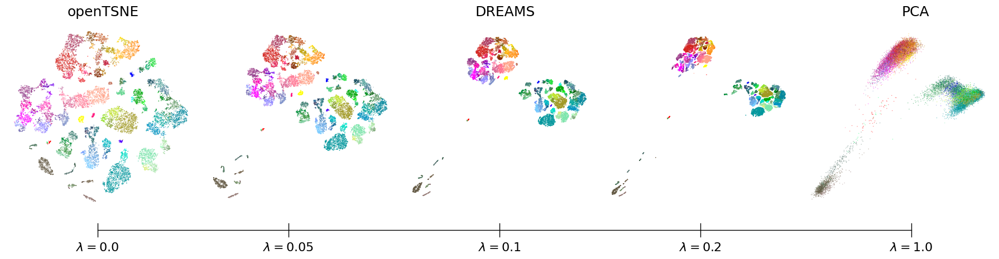

DREAMS - Experiments
========

This repository contains the code to reproduce the experiments of "DREAMS: Preserving both Local and Global Structure in Dimensionality Reduction".

DREAMS combines the local structure preservation of $t$-SNE with the global structure preservation of PCA via a regularization term that motivates global structure preservation. It provides a continuum of embeddings along a local-global spectrum with almost no local/global structure preservation tradeoff.



The code depends on several repositories, especially on [openTSNE](https://github.com/pavlin-policar/openTSNE) and [contrastive-ne](https://github.com/berenslab/contrastive-ne), which provide the $t$-SNE backends that DREAMS builds upon. The respective versions with additional regularizer are [DREAMS](https://github.com/berenslab/DREAMS) and [DREAMS-CNE](https://github.com/berenslab/DREAMS-CNE). The links to the original (unprocessed) datasets can be found further below.

# Installation

Clone this repository:
```
git clone https://github.com/berenslab/dreams-experiments.git
cd dreams-experiments
```
Create a conda environment (we used Python 3.12.11):
````
conda create -n myenv python=3.12
conda activate myenv
pip install -r requirements.txt
````
Install openTSNE with regularizer (DREAMS):
````
git clone --branch tp --single-branch https://github.com/berenslab/DREAMS.git
cd DREAMS
python setup.py install
cd ..
````
and contrastive-ne with a regularizer (DREAMS-CNE)
````
git clone --branch tp --single-branch https://github.com/berenslab/DREAMS-CNE.git
cd DREAMS-CNE
pip install --no-deps .
cd ..
````

For a simple example of running DREAMS, see [this notebook](simple_usage.ipynb). 

To run our experiments of competing methods, first clone the [SQuadMDS](https://github.com/NavidadK/SQuaD-MDS-and-FItSNE-hybrid) and then run (Note: in the code we also compare against StarMAP[^starmap], whose code is as of this moment not publicly available):
````
python experiments/run_other_methods.py
python experiments/run_openTSNE_exag.py
````
To run the DREAMS experiments (Note: run_dreams_mds is using the MDS embedding from run_other_methods.py):
````
python experiments/run_dreams_pca.py
python experiments/run_dreams_mds.py
python experiments/run_dreams_cne.py
python experiments/tradeoff_other_methods.py
````
To analyze and plot the results use:
````
experiments/plot_results_paper.ipynb
````
Here all plots of the paper can be found.

# Datasets
In the experiments, we benchmarked DREAMS using seven real-world datasets that are preprocessed as described in the paper. The preprocessed datasets can be found in the /data folder. The MNIST dataset was downloaded using the torchvision API (we only used the first 50 principle components of the 60k training samples). The remaining original (unprocessed) datasets can be found here:

| Dataset Name        | Source Link                                                                 |
|---------------------|------------------------------------------------------------------------------|
| Tasic et al.[^tasic]   | [Download](https://www.ncbi.nlm.nih.gov/geo/query/acc.cgi?acc=GSE115746)                     |
| Macosko et al.[^macosko]   | [Download](https://www.ncbi.nlm.nih.gov/geo/query/acc.cgi?acc=GSE63473)                     |
| Kanton et al.[^kanton]  | [Download](https://www.ebi.ac.uk/biostudies/arrayexpress/studies/E-MTAB-7552)                       |
| Wagner et al.[^wagner] | [Download](https://kleintools.hms.harvard.edu/paper_websites/wagner_zebrafish_timecourse2018/mainpage.html) 
| Packer et al.[^packer]   | [Download]( http://cb.csail.mit.edu/cb/densvis/datasets/)                     |
| 1000 Genomes[^genomes]  | [Download](https://ftp.1000genomes.ebi.ac.uk) 

# References
[^kanton]: Sabina Kanton, Michael James Boyle, Zhisong He, Malgorzata Santel, Anne Weigert, Fátima Sanchís-Calleja, Patricia Guijarro, Leila Sidow, Jonas Simon Fleck, Dingding Han, et al. Organoid single-cell genomic atlas uncovers human-specific features of brain development. Nature, 574(7778):418–422, 2019.
[^macosko]: Evan Z Macosko, Anindita Basu, Rahul Satija, James Nemesh, Karthik Shekhar, Melissa Goldman, Itay Tirosh, Allison R Bialas, Nolan Kamitaki, Emily M Martersteck, et al. Highly parallel genome-wide expression profiling of individual cells using nanoliter droplets. Cell, 161(5):1202–1214, 2015.
[^packer]: Jonathan S Packer, Qin Zhu, Chau Huynh, Priya Sivaramakrishnan, Elicia Preston, Hannah Dueck, Derek Stefanik, Kai Tan, Cole Trapnell, Junhyong Kim, et al. A lineage-resolved molecular atlas of C. elegans embryogenesis at single-cell resolution. Science, 365(6459):eaax1971, 2019.
[^tasic]: Bosiljka Tasic, Zizhen Yao, Lucas T Graybuck, Kimberly A Smith, Thuc Nghi Nguyen, Darren Bertagnolli, Jeff Goldy, Emma Garren, Michael N Economo, Sarada Viswanathan, et al. Shared and distinct transcriptomic cell types across neocortical areas. Nature, 563(7729):72–78, 2018.
[^genomes]: The 1000 Genomes Project Consortium. A global reference for human genetic variation. Nature, 526(7571): 68–74, 2015.
[^wagner]: Daniel E Wagner, Caleb Weinreb, Zach M Collins, James A Briggs, Sean G Megason, and Allon M Klein. Single-cell mapping of gene expression landscapes and lineage in the zebrafish embryo. Science, 360(6392): 981–987, 2018.
[^starmap]: Koshi Watanabe, Keisuke Maeda, Takahiro Ogawa, and Miki Haseyama. StarMAP: Global neighbor embedding for faithful data visualization. arXiv preprint arXiv:2502.03776, 2025.